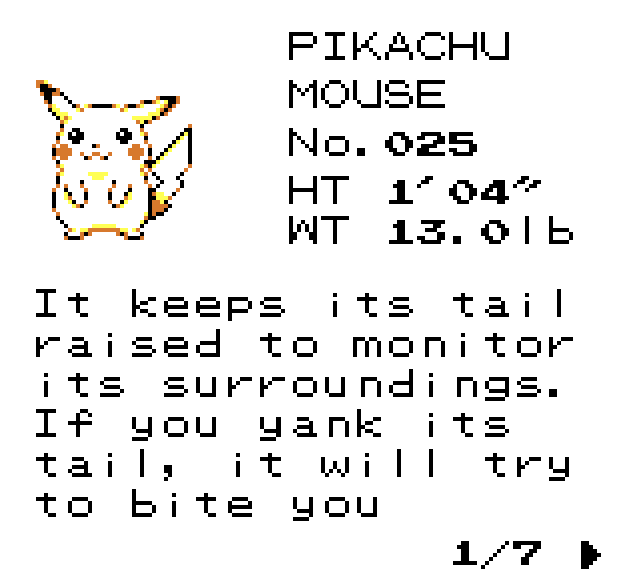
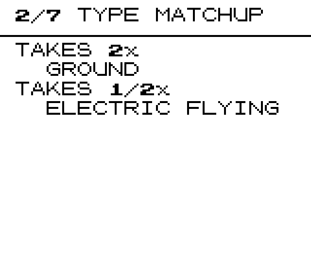
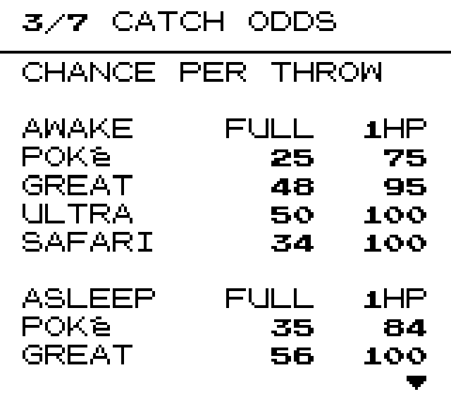
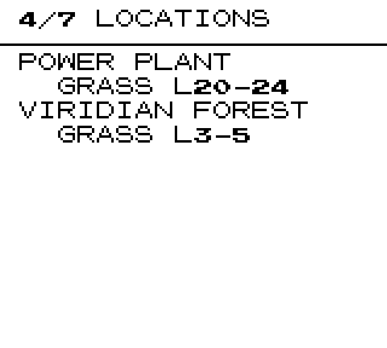
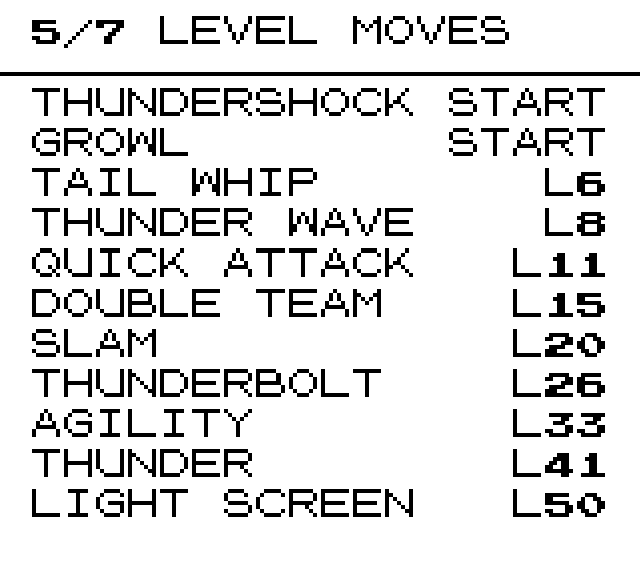
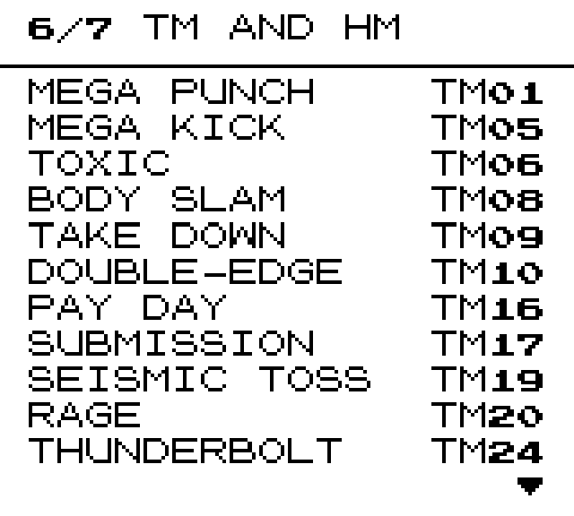
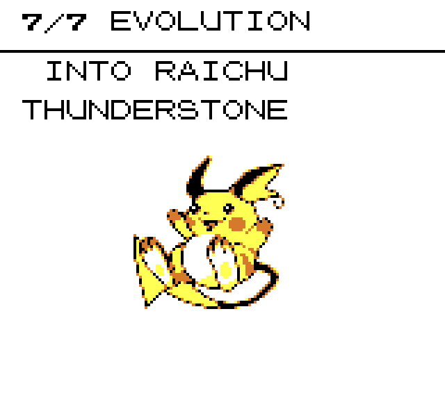

# Dex Pages

> This mod was coded by AI.

Adds pages to the POKéDEX entry. **A** moves through them, **B** closes.

Your usual page is untouched and still comes first. The `1/7 ▶` in the
corner is the only mark on it.

## The pages

### Type matchup

### Catch odds

### Locations

### Level moves

### TM and HM

### Evolution

## Buttons

| | |
| --- | --- |
| **A** | next page, wrapping round |
| **B** | close |
| **LEFT** / **RIGHT** | back and forward a page |
| **UP** / **DOWN** | scroll a long page, pick an evolution, or step to the next POKéMON |

Stepping through the dex keeps the page you are on, so you can hold **DOWN**
comparing catch odds across species without reopening each entry. Only ones
you have seen are in the order.

## Options

Set these in the in-game mod manager.

| Option | | Default |
| --- | --- | --- |
| `DEX PAGE BUTTON` | A AND D-PAD · D-PAD ONLY · OFF | A AND D-PAD |
| `TYPE MATCHUP PAGE` | show it | on |
| `CATCH ODDS PAGE` | show it | on |
| `LOCATIONS PAGE` | show it | on |
| `LEVEL MOVES PAGE` | show it | on |
| `TM/HM PAGE` | show it | on |
| `EVOLUTION PAGE` | show it | on |
| `OWNED DATA ONLY` | wait until you own one | on |

`D-PAD ONLY` gives A back its old job of closing the entry.

`OWNED DATA ONLY` follows the game's own rule — the vanilla page hides height,
weight and the description until you own a species, so the extra pages wait
for the same moment.

## Notes

- **The numbers are the game's own.** They come from its catch routine and
  its type chart, so a mod that changes a ball or edits the chart changes
  these pages with it.
- **Turning every page off leaves the vanilla entry**, not a blank screen.
- **Only one mod can own the dex page.** If you run another that replaces the
  POKéDEX entry screen, whichever loads last wins. Run one or the other.
- Works on Red, Blue and Yellow.

## Install

Download the `.zip` from
[Releases](https://github.com/ddagent/gen1recomp-dex-pages/releases) and
install it from the game: **MODS → Import mod .zip**. After that the launcher
offers **Update** whenever a new version appears.
